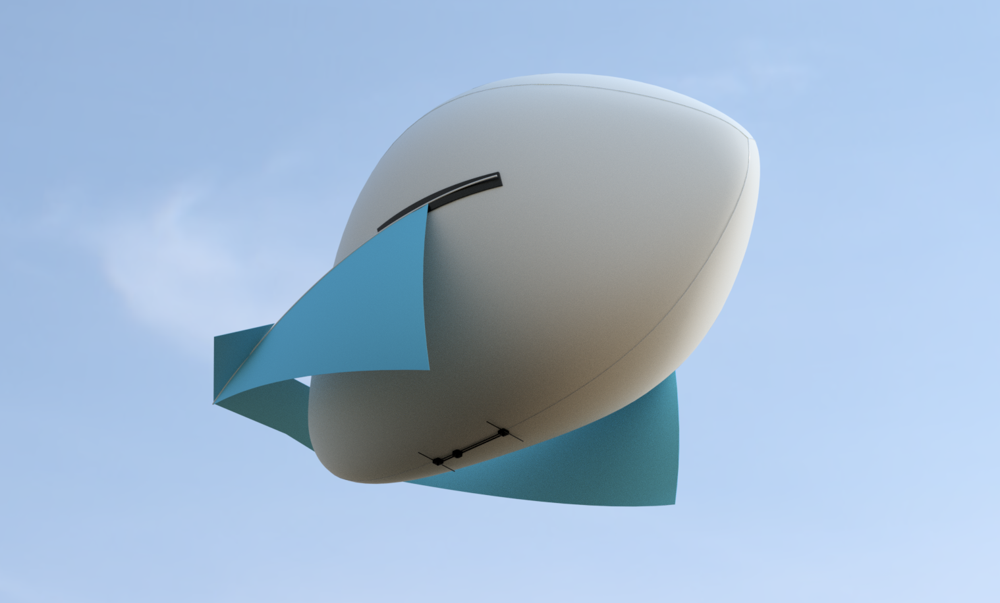

# the Airpup kite balloon
 

This repository contains the 2D patterns for constructing [Airpup](https://headfullofair.com/tags/airpup) as well as a corresponding 3D model. 2D patterns are made with [QCAD](https://qcad.org), the 3D model was made in Audodesk's Fusion 360.

See more of my kite and balloon projects at [headfullofair.com](https://headfullofair.com).

### files

* [/rails](rails), *belly mounting rails and STLs*
* BOM.ods, *Bill of Materials*
* V2-FIN.DXF, *panel diagram of the fin/wing structure and attachment*
* V2-ENVELOPE.DXF, *flat pattern of the balloon envelope*
* 72in-Airpup-model-v1.step/iges, *full-size 3D Airpup- Envelope and belly mount are accurate, Fin pattern [needs updating](https://github.com/mathewlippincott/airpup-balloon/issues/1) with transverse spar*

### mounting rails
The folder */rails* contains CAD files and STLs for end caps and two-part slide mount:

### envelope construction

The envelope is a 3-gore pattern seamed in a single run:

### envelope volume and flat patterns

Airpup's envelope volume is roughly equivalent to a sphere whose radius is 1/3 the length of an inflated Airpup.

Airpup's flat envelope pattern is 1.147 times the length of an inflated Airpup.

### contribute

* Use the 3D models to plan your payload attachement. Please [reach out](https://headfullofair.com/contact) and share.
* Fork this repository and improve the design or documentation.
* Add or comment on [issues in this repository](https://github.com/mathewlippincott/airpup-balloon/issues).
* [show me](https://headfullofair.com/contact) kite and balloon stuff.

All contributors are asked to abide by the [code of conduct](codeofconduct.md).

*Licensed under the [CERN OHL 1.2](LICENSE.md)*.

