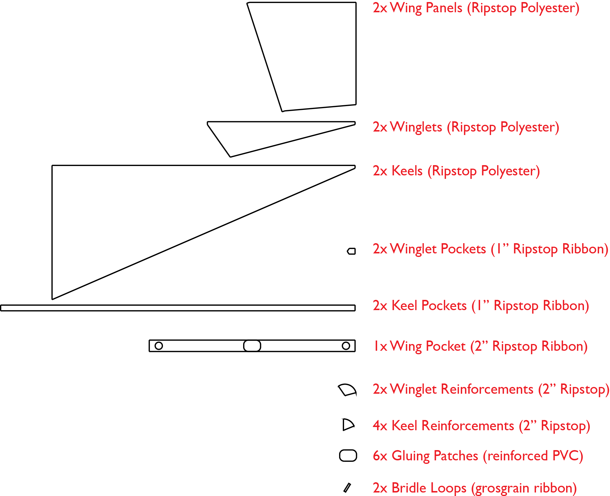
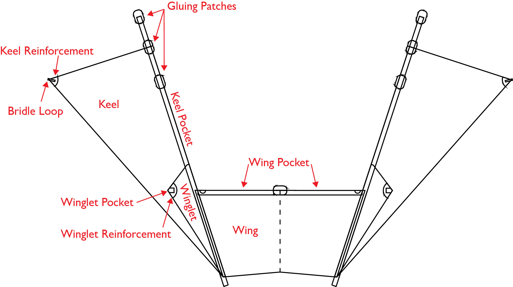
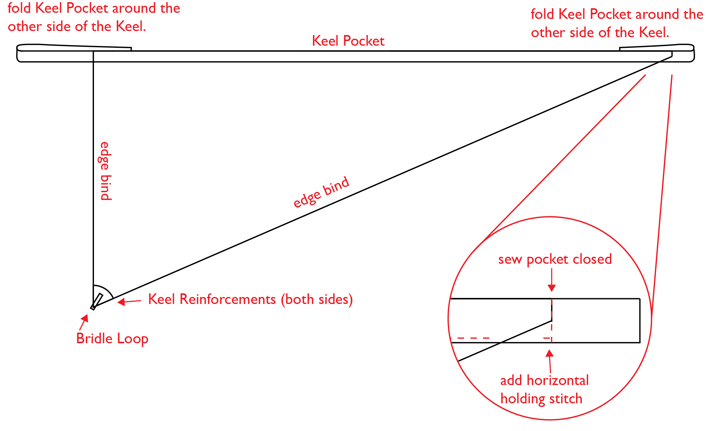
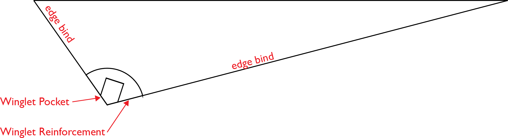
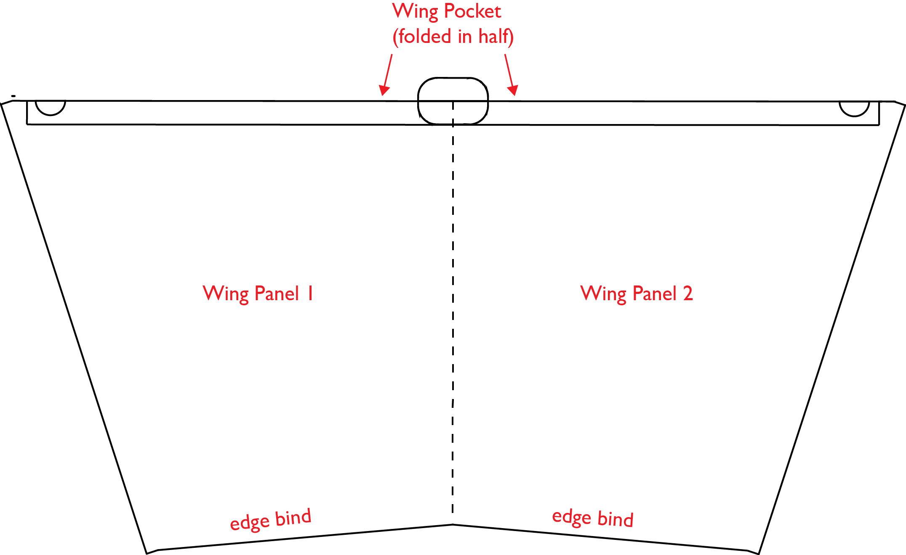
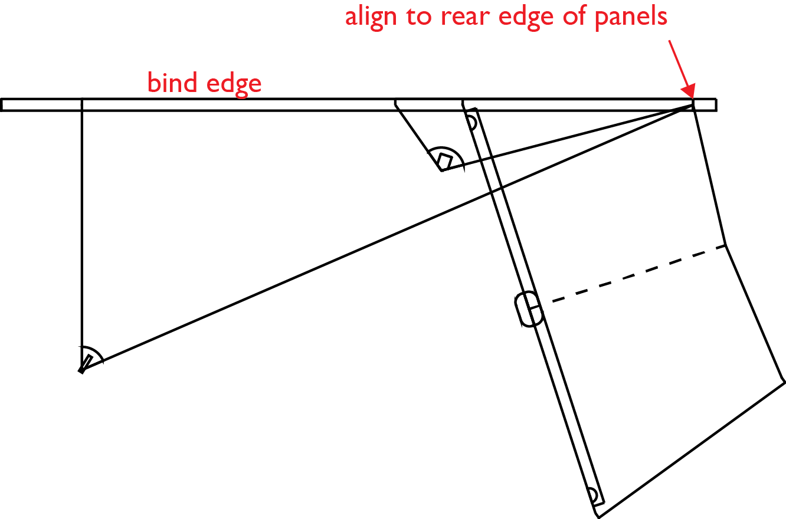
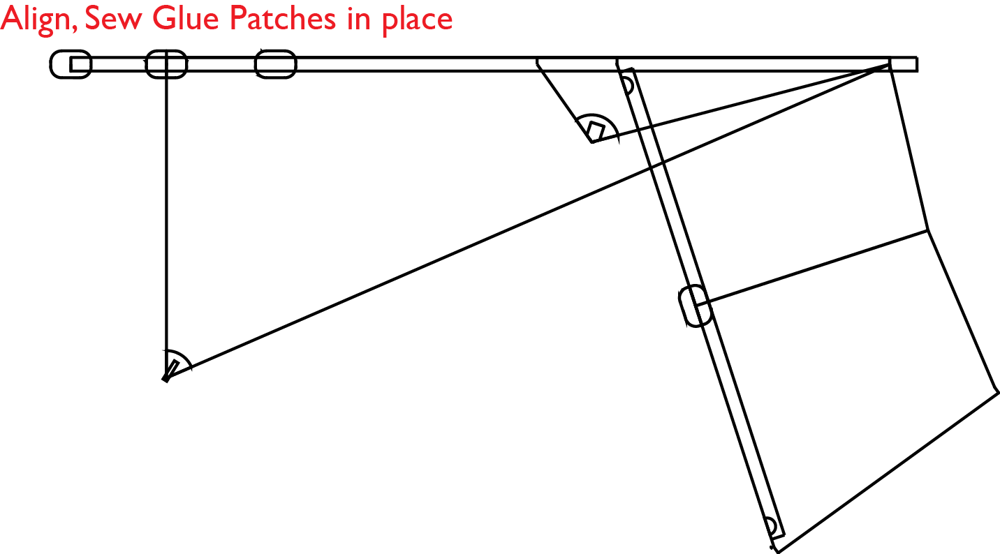

## Components:

* Ripstop Polyester Panels (0.6oz)
   * __2x__ Wing Panels
    * __2x__ Winglets
    * __2x__ Keels
* 1-inch Ripstop Nylon Ribbon components(1.75oz)
	 * __2x__ Winglet Pockets
	 * __2x__ Keel Pockets
	 * All edge binding
* 2-inch Ripstop Nylon Ribbon (1.75oz)
	 * __2x__ Wing Pocket (has Gluing Patch sewn in center)
	 * __2x__ Winglet Reinforcements
	 * __4x__ Keel Reinforcements
* Fiberglass Reinforced PVC
	 * __6x__ Gluing Patches for attachment to the ballon envelope
    Grosgrain Ribbon
	 * __2x__ Bridle Loops

## Assembly 

The fin structure of Airpup is assembled as individual panels which are then joined by edge binding along the length of the Keel Pockets.

Most stitches are a 3mmx3mm zigzag stitch, unless specified. 

### Keels

2. Tack Keel Reinforcements to both sides of Keel tips.
3. Edge bind two exposed sides of Keel and Winglet.
7. Sew Bridle Loops to Keels.
8. Tack Keel Pockets to Keels, wrapping folded ends of Keel Pockets around to the inside of the Keels.
9. Sew Keel Pocket Closed with a vertical straight stitch, curving to a horizontal hold stitch. Reverse to double stitch.
10. Sew bottom of Keel pocket to Keel, leaving 1/8" margin and 1 1/4" gap for Pocket entry.

### Winglets

1. Tack Winglet Pockets and Reinforcements to one side of Winglet's tips.
3. Edge bind two exposed sides of Keel and Winglet.
4. Sew sides of Winglet Pockets in place.
5. Sew Winglet Reinforcements in place.

### Wing

1. Tack Wing panels together with seam tape and stitch.
2. Tape Wing Pocket in place, folded in half over the front edge of Wing. Tape in place with masking tape, then stitch, leaving a 1/2" wide pocket.
3. edge bind the back edge of the Wing.

### Combining Panels and Finishing

1. Align Wing, Keel, and Winglet, to the back corner of the ripstop polyester panels. Tack together. Edge bind together.
2. Align other Keel and Winglet with Wing, aligning to back corner.
2. Mark locations of Gluing Patches with alignment tool and tape in place with masking tape. Check symmetry of the two sides and adjust Gluing Patches if necessary.
3. Sew Gluing Patches along 2" marked center, sewing to the edge-bound section and along the bottom of the pocket.

 

### Grouping Assembly Tasks
The assembly is easier to perform if edge binding and other tasks are grouped. This is my suggested order.

1. Tack Winglet Pockets and Winglet Reinforcements to one side of Winglets tips.

2. Tack Keel Reinforcements to both sides of Keel tips.

3. Edge bind two exposed sides of Keel and Winglet.

4. Edge bind back edge of Wing.

6. Sew Keel Reinforcements to Keels.

7. Sew Bridle Loops to Keels.

8. Tack and sew Keel Pocket to Keel.

8. Sew Wing Pocket onto front edge of Wing.

9. Align one edge of Keel, Winglet, and Wing to the back corner of polyester panels.

10. Tack together Keel, Winglet, Wing, and Keel Pocket.

11. Edge bind.

12. Align other side of Keel, Winglet, Wing and Keel Pocket, aligning to back corner.

13. Edge Bind.

15. Use alignment tool to identify Gluing Patch locations.

16. Tape Gluing Patches in place, sew into location.

